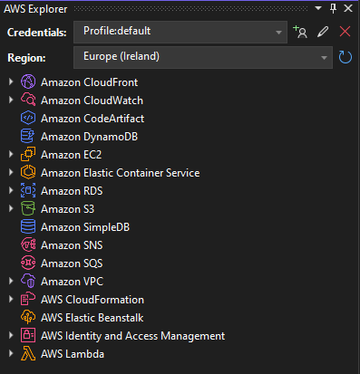

# Serverless C# on AWS Example

Example website for a band called the See Sharps, built with C# on AWS.

## Setup & Prerequisites

1. Register an account with AWS if you don't have one
2. Download and install the [AWS Toolkit for Visual Studio](https://marketplace.visualstudio.com/items?itemName=AmazonWebServices.AWSToolkitforVisualStudio2022)
3. Obtain AWS access keys: [guide here](https://docs.aws.amazon.com/toolkit-for-visual-studio/latest/user-guide/keys-profiles-credentials.html).
4. Open [./ServerlessAwsWebsite.sln](./ServerlessAwsWebsite.sln) in Visual Studio and choose _View > AWS Explorer_ from the menu.
5. You should be able to select a region and browse your AWS resources in the AWS Explorer window.  We will go over some of the features of the AWS Explorer at the start of this workshop



### Switching Branches

There are three branches in this repository, each one represents an increasingly complex version of this serverless application.  All the infrastructure needed to run the application is configured in the [./serverless.template](./serverless.template) [SAM](https://aws.amazon.com/serverless/sam/) template. You deploy a version by checking out the relevant branch, right-clicking on the project name and selecting "Publish to AWS...".

To begin, switch to stage 1 and see the steps in this readme

```sh
git switch stage-1
```