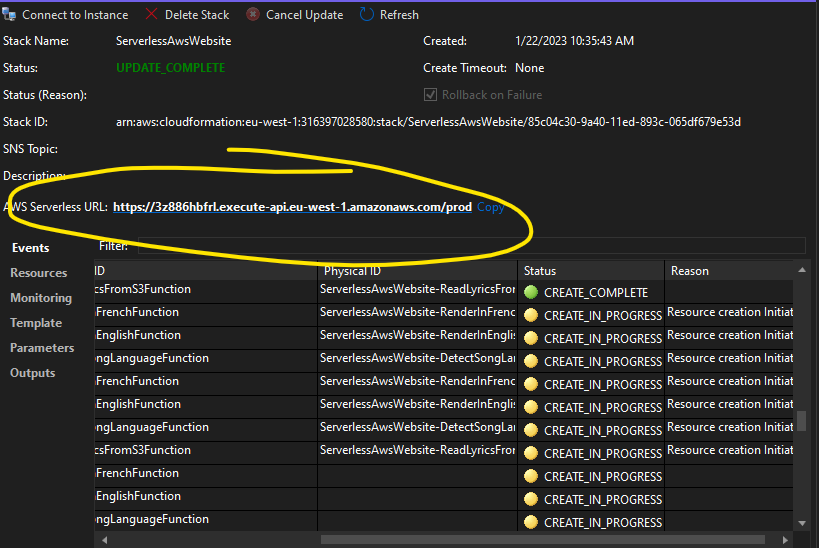

# Serverless C# on AWS Example

Example website for a band called the See Sharps, built with C# on AWS.

## >>> This is Stage 3 <<<

To go back to stage 2 run `git switch stage-2`

Stage 3 adds an API Gateway service to the front of our system so song lyrics can be sent over HTTP to the songs bucket.  It also adds another AWS Lambda function that is used to save the lyrics file..  To deploy this stage to your AWS account:


### 1. Publish the solution

Right click the project name in Visual Studio and select "Publish to AWS Lambda..."


### 2. Grab the public url of the new API Gateway

You can use this url to POST lyrics files to your S3 bucket and kick off the state machine from stage 2.




### 3. Test it out!

a) Send a POST request to your `<gateway-url>` from step 2 above.  Upload a text file as the body of the POST request.  The following `curl` command will do this from the command line:

```sh
curl -X POST https://<gateway-url>/prod/test --upload-file C:\Temp\textfile.txt
```

b) Go to your static website and see your new file appear as a new song!  You can also look at the execution logs of your state machine in AWS Step Functions in the [management console](https://eu-west-1.console.aws.amazon.com/states/home)