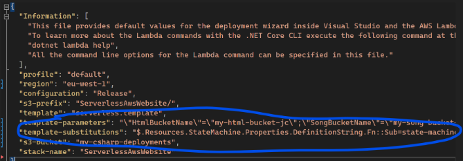
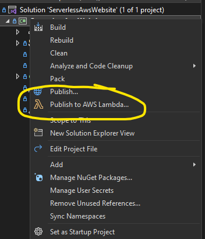
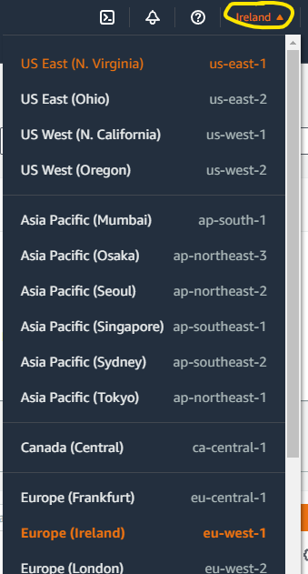
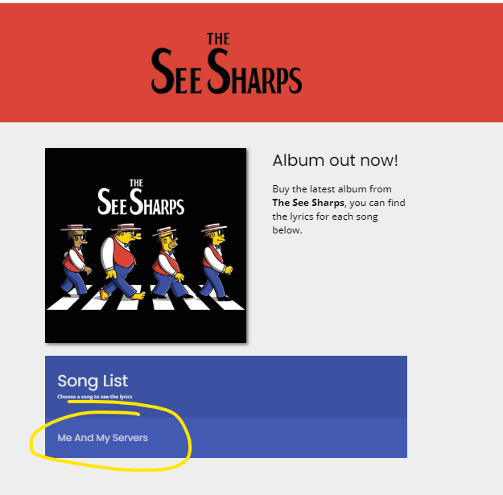

# Serverless C# on AWS Example

Example website for a band called the See Sharps, built with C# on AWS.

## >>> This is Stage 2 <<<

To go back to stage 1 run `git switch stage-1`

Stage 2 creates an AWS Step Functions state machine that detects the language of the song lyrics, then renders them to HTML using a different template for French and English songs..  To deploy this stage to your AWS account:


### 1. First off, add this line to your aws-lambda-tools-defaults.json file:

```json
"template-substitutions": "$.Resources.StateMachine.Properties.DefinitionString.Fn::Sub=state-machine.json",
```



This template substitution allows us to define the state engine in a separate JSON file called [./state-machine.json](./state-machine.json) and bundle it into the SAM template on publish.


### 2. Publish the solution

Right click the project name in Visual Studio and select "Publish to AWS Lambda..."




### 3. Wait 5 minutes after deployment

After the CloudFormation stack has finished updating we will need to wait around 5 minutes for the EventBridge connection to come alive.  This is the connection that links the S3 bucket to the state machine.


### 4. Test it out!

a) Upload one of the lyrics files from the [./sample-lyrics](./sample-lyrics) folder in this repository into the songs bucket (the one you created for `SongBucketName`).  There is a French song in this folder called [Les Zebres Dans La Savane.txt](./sample-lyrics/Les%20Zebres%20Dans%20La%20Savane.txt), try this one.

b) Open the AWS Step Functions management console at this link: [https://eu-west-2.console.aws.amazon.com/states/home](https://eu-west-2.console.aws.amazon.com/states/home) (NOTE: if your state engine does not show up you may need to change the region in the top right)



e) Check that a new execution has happened and click it to explore the state machine path this execution took.

f) Open the url for your web page.  The new song will appear in the list here:




## Troubleshooting

#### The state engine does not start an execution when I upload a file to the song bucket?

Just wait a bit longer.  You can read more about how the S3 bucket triggers the AWS Step Functions via EventBridge on this page: [Starting a State Machine Execution in Response to Amazon S3 Events](https://docs.aws.amazon.com/step-functions/latest/dg/tutorial-cloudwatch-events-s3.html)