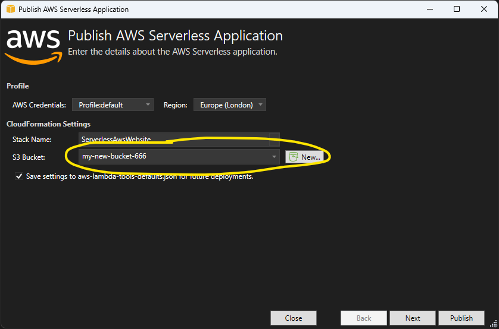

# Serverless C# on AWS Example

Example website for a band called the See Sharps, built with C# on AWS.

## Setup & Prerequisites

1. Register an account with AWS if you don't have one
2. Download and install the [AWS Toolkit for Visual Studio](https://marketplace.visualstudio.com/items?itemName=AmazonWebServices.AWSToolkitforVisualStudio2022)
3. Obtain AWS access keys: [guide here](https://docs.aws.amazon.com/toolkit-for-visual-studio/latest/user-guide/keys-profiles-credentials.html).
4. Open [./ServerlessAwsWebsite.sln](./ServerlessAwsWebsite.sln) in Visual Studio and choose _View > AWS Explorer_ from the menu.
5. You should be able to select a region and browse your AWS resources in the AWS Explorer window.  We will go over some of the features of the AWS Explorer at the start of this workshop


## Switching Branches

There are three branches in this repository, each one represents an increasingly complex version of this serverless application.  All the infrastructure needed to run the application is configured in the [./serverless.template](./serverless.template) [SAM](https://aws.amazon.com/serverless/sam/) template. You deploy a version by checking out the relevant branch, right-clicking on the project name and selecting "Publish to AWS...".


## >>> This is Stage 1 <<<

This stage creates an AWS Lambda function that renders some song lyrics into an HTML web page, then saves it to a publicly facing S3 bucket.  To deploy this stage to your AWS account:

### 1. First off, run this git command:
```sh
git update-index --skip-worktree aws-lambda-tools-defaults.json
```
This will allow you to make local changes to the [./aws-lambda-tools-defaults.json](./aws-lambda-tools-defaults.json) file that will persist when you switch branches later on.

### 2. Open the solution
Open [./ServerlessAwsWebsite.sln](./ServerlessAwsWebsite.sln)

### 3. Start the Publish Wizard
Right click the project name in Visual Studio and select "Publish to AWS Lambda..."


### 4. Create a deployments bucket

This is an S3 bucket that the deployment tool will use to store your compiled code.  You should select "New..." and enter a unique name for your deployments bucket.  Ensure _Save settings to aws-lambda-tools-defaults.json_ is checked.


### 5. Enter names for your object buckets

All S3 buckets in AWS need to have [globally unique names](https://docs.aws.amazon.com/AmazonS3/latest/userguide/bucketnamingrules.html), so enter names for the two S3 buckets you will be using for your application.  This can be anything you like.


### 6. Click Publish!

When the wizard completes it will open a CloudFromation window that displays the status of your deployment.

### 7. See your new S3 Buckets in the AWS Explorer

Open the AWS Explorer window (_View > AWS Explorer_) and expand the **Amazon S3** node to see the new S3 buckets you defined in step 5.


### 8. Test it out!

a) Upload one of the lyrics files from the [./sample-lyrics] in this repository into whichever bucket you created for `SongBucketName`.

b) Expand the **AWS Lambda** node in the AWS Explorer tree and find your new lambda function.  It will have a name beginning with `ServerlessAwsWebsite-RenderHtml....`

c) Check the _Logs_ tab of your lambda function to see if it executed!

